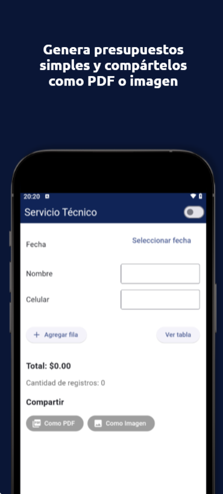

# Servicio técnico

<!--  -->

Aplicación hecha en Flutter generar presupuestos sencillos. Incorpora detalles del cliente y lista cada ítem del presupuesto.

## Características
- Guarda los ultimos 5 presupuestos.
- Se puede cargar en el presupuesto el **numero de contacto para contactarse por Whatsapp** si asi se requiere.
- Se puede exportar los presupuestos como **Imagen** (para compartir) o guardar como **PDF**.

## Librerías utilizadas

## Instalacion
1. **Clonar el repositorio:**
  ```bash
    git clone example@example.com/path/to/my-project.git 
  ```

2. **Instalar dependencias:**
  ```bash
    flutter pub get
  ```

3. **Ejecución**  
Para ejecutar la aplicación en un emulador o dispositivo físico:
  ```bash
    flutter run
  ```